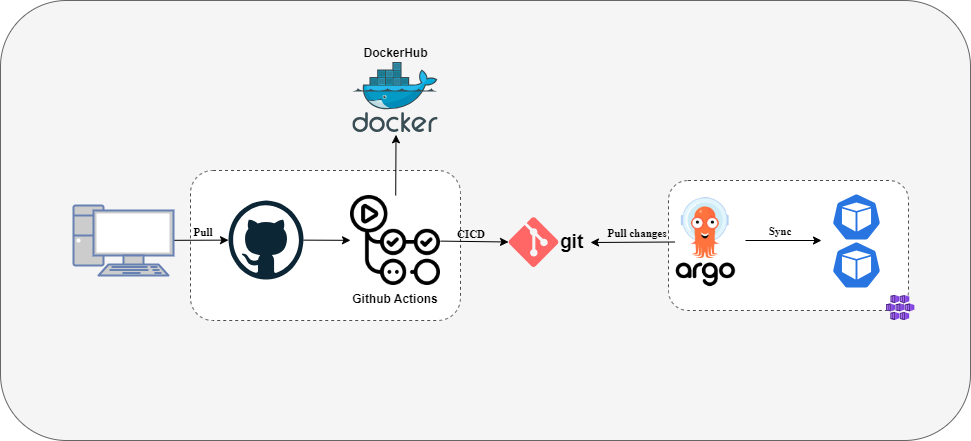

# gitops-poc-v1
gitops-poc is one inititive to understand the questions about gitops using kubernetes and gitops tools (argo, flux) 

The first version have this implmentation design. 

## Versão 1
To first version we used this presente ativits checklist. 

1. Instalção do argocd. 
1. Criação de repositorio (Projeto)
1. Implementação de codeigo fonte + dockerfile
1. Criação de manifestos 
1. Criação de Repos Gitops 

### Instalation argocd
- [x] Instalation Minikube.
- [x] Instalation Helm
- [x] Instalation ArgoCD

